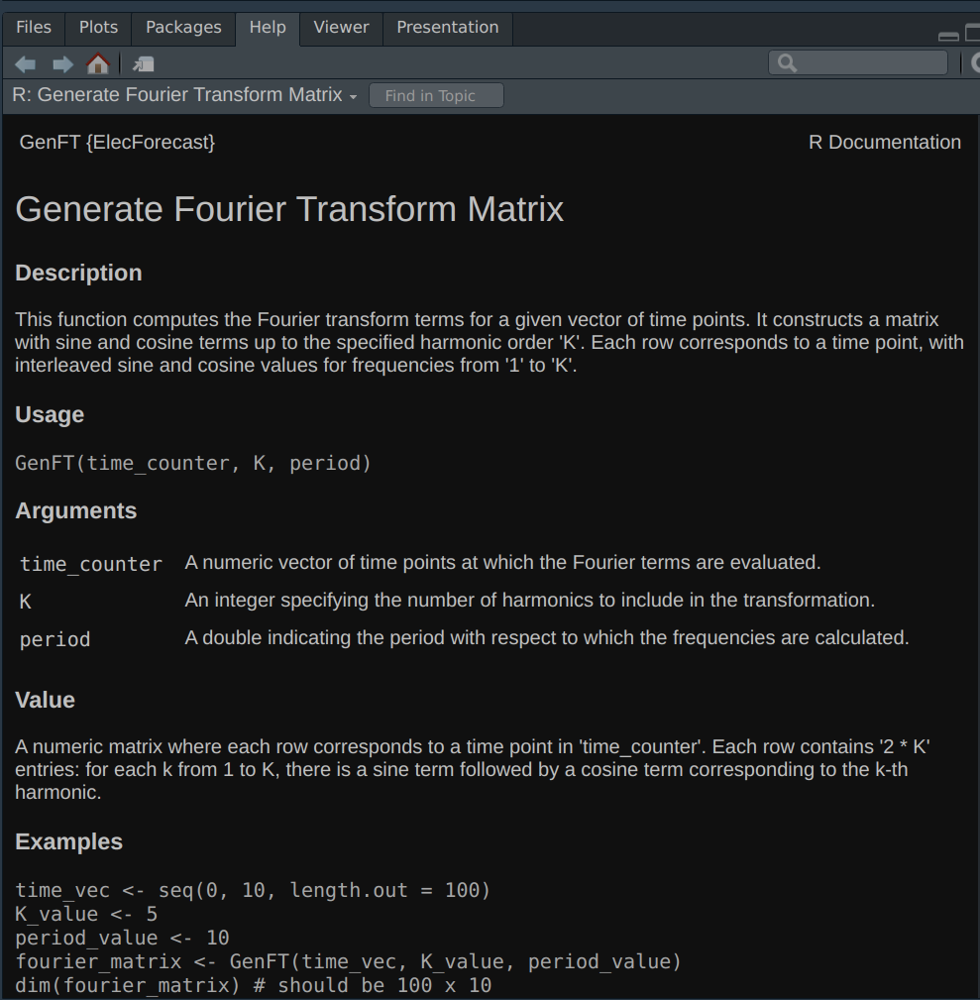

# Cleaning the Data

## Data overview

We are analyzing a set of Irish household electricity demand available from the [`electBook` package](https://github.com/mfasiolo/electBook/tree/master). (We trimmed the dataset slightly to focus on the year of 2010) We have three datasets:

- `indCons`: 16799 x 2672 matrix of individual household electricity consumption. Each column corresponds to a household and each row to a time point. Demand is observed every half hour, so there are 48 observations per day per household.
- `survey`: 2672 row dataframe of household survey data. This dataset contains household level data on variables such as social class, renting vs. owning, appliances, etc.
- `extra`: 16799 row dataframe of time-related variables. This dataset contains the date-time of each demand observation, time of year, day of week, time of day, whether the day was a holiday, and external temperature.

```{r message = FALSE}
# Extract individual dataframes
library(electBook)
library(tidyverse)
data(Irish)
indCons <- Irish[["indCons"]]
survey <- Irish[["survey"]]
extra <- Irish[["extra"]]
```

## Social class

Our goal in this project is to **investigate demand patterns across different social classes**. The dataset includes 5 social classes, defined by the occupation of the head of household:

+ AB: managerial roles, administrative or professional
+ C1: supervisory, clerical, junior managerial
+ C2: skilled manual workers
+ DE: semi-skilled and unskilled manual workers, state pensioners, casual workers
+ F: farmers

```{r}
# Vector of social classes
soc_classes <- c(unique(survey["SOCIALCLASS"]))$SOCIALCLASS

# Number of households per class
survey %>% 
  group_by(SOCIALCLASS) %>%
  summarise(n_households = n()) %>% 
  kableExtra::kable(col.names = c("Social Class", "Number of Households"))
```

We can look at the average daily demand for each social class to see the differences in patterns between classes:

```{r}
df_day <- readRDS(here::here("data/df_day.RData"))

# Plot average daily demand for each social class
df_day %>%
  mutate(dateTime = as.POSIXct(rownames(df_day))) %>% 
  pivot_longer(cols = all_of(soc_classes), names_to = "class", values_to = "demand") %>%
  ggplot(aes(x = dateTime, y = demand, color = class)) +
  geom_line() +
  labs(x = "Date", y = "Demand", color = "Social Class") +
  theme_bw()
```

Due to the computational expense of fitting our model, we simplify the problem and consider modelling the average demand for each social class separately, i.e., we fit a seperate model for each social class. However, a further extension that may be considered is to include the social class as a categorical variable and possibly even further interaction term, to investigate the impact of social class on demand more directly.

## Loading and Structure

We cleaned the data using the code available in [`data_cleaning.R`](https://github.com/Shermjj/SC-2-Electric-Boogalo/blob/main/data_cleaning.R), which writes out three dataframes: `df_halfhr`, `df_hr`, and `df_day`. These dataframes contain the half-hourly, hourly, and daily average demand data for each social class, as well as temperature (also aggregated to the relevant time scale), time of year (the time of year with 1st January represented as 0 and 31st December represented as 1), and day of the week. These dataframes are written to the [`data` folder](https://github.com/Shermjj/SC-2-Electric-Boogalo/tree/main/data).

## Feature engineering

Based on exploratory data analysis, we created some features from the dataset to model demand. Feature engineering (with the exception of the addition of the Fourier terms) was performed in the [`feature_engineering.R` script](https://github.com/Shermjj/SC-2-Electric-Boogalo/blob/main/feature_engineering.R), and the resulting dataframes `df_halfhr_scaled`, `df_hr_scaled`, and `df_day_scaled` were saved to the [`data` folder](https://github.com/Shermjj/SC-2-Electric-Boogalo/tree/main/data).

```{r}
# Load transformed data for all time scales
df_halfhr_scaled <- readRDS(here::here("data/df_halfhr_scaled.RData"))
df_hr_scaled <- readRDS(here::here("data/df_hr_scaled.RData"))
df_day_scaled <- readRDS(here::here("data/df_day_scaled.RData"))
```


### Time-related features

We extracted the hour of the day and the month from the date-time variable. For the dataset at daily resolution, we did not use hour of the day. We also used one-hot encoding to include the day of the week in our models.

### Temperature

We can visualize the relationship between temperature and the aggregate demand over time across all households:

```{r message=FALSE}
# Aggregate demand over all households
agg <- rowSums(indCons)
# Add temperature data
temp_demand <- data.frame(demand = agg) %>%
  bind_cols(Irish[["extra"]])

# Demand vs. temperature
ggplot(temp_demand, aes(x = temp, y = demand)) +
  geom_point() +
  labs(x = "Temperature", y = "Total Demand") +
  theme_bw()

# Demand over time colored by temperature
ggplot(temp_demand, aes(x = dateTime, y = demand, color = temp)) +
  geom_point() +
  viridis::scale_color_viridis(option = "magma") +
  labs(x = "Date", y = "Total Demand", color = "Temperature") +
  theme_bw()
```

We can see that during the warmer summer months, demand dips, although the pattern is messy. We included linear and quadratic terms for temperature in our models to capture the non-linear relationship between temperature and demand.

### Fourier terms

We found evidence for daily and annual seasonality patterns in our data. The temperature plot above shows the annual pattern of high energy usage in winter months, with a dip in the summer months. To see the pattern of daily fluctuations, we can view total demand by hour of the day:

```{r}
# Plot demand for each hour 
agg_hour <- data.frame(total_demand = agg) %>% 
  bind_cols(select(extra, dateTime)) %>% 
  mutate(hour = hour(dateTime))
ggplot(agg_hour, aes(x = hour, y = total_demand)) +
  geom_point() +
  geom_smooth() +
  labs(x = "Hour", y = "Total Demand") +
  theme_bw()
```


We used Fourier terms to capture the patterns of seasonality in the data. Fourier terms are a set of sine and cosine functions with different frequencies that can be used to model periodic patterns. For a given period $P$, the Fourier terms are defined as follows: $$\text{sin}_k(t) = \sin\left(\frac{2\pi kt}{P}\right), \quad \text{cos}_k(t) = \cos\left(\frac{2\pi kt}{P}\right)$$
where $k$ is the frequency and $t$ is the time. Then a partial Fourier sum can be written as $$ y(t) = \beta_0 + \sum_{k=1}^{K} \left( \beta_{1k} \sin\left(\frac{2\pi kt}{P}\right) + \beta_{2k} \cos\left(\frac{2\pi kt}{P}\right) \right) $$
where $K$ is the maximum order of Fourier terms to use.

We used Fourier terms to model the daily and annual seasonality in the data. Since our dataset is missing data for some days, we needed to adjust the $t$ used to calculate the Fourier terms to account for these gaps. In the [`feature_engineering.R` script](https://github.com/Shermjj/SC-2-Electric-Boogalo/blob/main/feature_engineering.R), we added the variable `counter` to all dataframes. This variable increments by one for each time step (half hour, hour, or day) in the dataframe, reflecting the fact that some days are missing. These `counter` variables were then used later on to generate Fourier terms for our models. We wrote an `Rcpp` function in our package called `GenFT`, which creates a matrix of Fourier terms given a time counter variable representing $t$, the maximum order of the Fourier terms $K$, and the number of time increments in a period $P$.

## Scaling

For ridge regression, we centered and scaled all variables used in the models to have mean 0 and standard deviation 1. This is because there is a single universal penalty ($\lambda$ for ridge regression) for all covariates, and hence if the covariates are of different scale, the penalisation may not be meaningful. For Gaussian process regression, we used the unscaled data.

## Training and testing

Because this is time series data, we needed to make sure the training and testing data were both contiguous. We trained the models on the first 90% of the rows and tested on the final 10%.

# `ElecForecast` package

We present a fully documented and tested package, `ElecForecast`, which is available on github [here](https://github.com/Shermjj/SC-2-Electric-Boogalo). The package binary is available [here](https://github.com/Shermjj/SC-2-Electric-Boogalo/blob/main/ElecForecast_1.0_R_x86_64-pc-linux-gnu.tar.gz), and can be used for installation, as we will show.

To install the package binary, we can call the following function:
```{r,eval=FALSE}
install.packages("ElecForecast_1.0_R_x86_64-pc-linux-gnu.tar.gz", repos = NULL, type="source")
```


We can then load the package as with any other R package.
```{r}
# Load our package
library(ElecForecast)
```

In order to view the documentation of this package, we can prepend `?` to any functions exposed in this package, for example:
```{r, eval=FALSE}
?GenFT
```
{width=50%}

# Ridge Regression

The first model we implemented to predict electricity demand for each class was ridge regression.

## Theory

Ridge regression is a method for penalized regression. Consider the model $$Y_i^0 = \alpha + \beta x_i^0 + \epsilon_i, \quad  i = 1,..., n$$
where $\beta \in \mathbb{R}^p$, $\alpha \in \mathbb{R}$, and for all $i, l \in \{1, ..., n\}$, $\mathbb{E}[\epsilon_i] = 0$ and $\mathbb{E}[\epsilon_i \epsilon_l] = \sigma^2 \delta_{il}$ for some $\sigma^2 > 0$. Then the ridge regression estimator is defined as the minimizer of the following objective function:
$$(\hat{\alpha}_\lambda, \hat{\beta}_\lambda) = \mathrm{argmin}_{\alpha \in \mathbb{R}, \beta \in \mathbb{R}^p} \lVert y^0 - \alpha - \boldsymbol{X}^0 \beta \rVert^2_2 + \lambda \lVert \beta \rVert^2_2$$
where $\lambda > 0$ is a tuning parameter and $\lVert \cdot \rVert_2$ denotes the Euclidean norm. Ridge regression is thus imposing a penalty on the size of $\beta$, with the strength of that penalty determined by the choice of $\lambda$. The coefficients of the model $\beta$ will be shrunk towards zero, but will not be set to zero (as opposed to in lasso regression).

We consider using this model as we have performed significant feature transformation, and thus are at risk of overfitting the data. In this case, penalised regression can be used to reduce overfitting in our model and to produce a better predictive performance.

## Model

We performed ridge regression using the model detailed above, with the following input variables:

+ Temperature and squared temperature
+ Time of year
+ Hour
+ Month
+ One-hot encoded variables for each day of the week
+ Daily Fourier terms $\text{sin}_k(t) = \sin\left(\frac{2\pi kt}{P}\right), \quad \text{cos}_k(t) = \cos\left(\frac{2\pi kt}{P}\right)$ for $k \in \{1,...,K\}$
+ Annual Fourier terms likewise

We predicted demand for each of the five social classes at all three time scales (half hour, hour, and day).

We had two hyperparameters to tune: the standard ridge regression parameter $\lambda$ and the maximum order of the Fourier terms included $K$. For sake of simplicity, we elected to use the same $K$ value for both the daily and the annual terms.

## Implementation

We implemented ridge regression using `RcppArmadillo` in our functions `RidgeReg` and `RidgeRegPar`, the latter of which uses `RcppParallel` to parallelise the matrix multiplication. These functions yield the same predictions as those of the `glmnet` package (see the "Comparison with `glmnet`" section of [`ridge_regression.Rmd`](https://github.com/Shermjj/SC-2-Electric-Boogalo/blob/main-edit-cbm/notes/ridge_regression.Rmd) for a demonstration).

To select $\lambda$ and $K$, we used $k$-fold cross-validation to perform a grid search across all combinations of $\lambda$ and $K$. We implemented this cross-validation in the function `parallel_ridge_cross_validation`, which calls `RidgeRegPar`. An extension of this work could involve parallelizing the grid search in addition to the matrix multiplication, although we did not encounter performance issues for data of this size.

## Results

### Aggregated Half-Hourly Data

We first split the dataset into training and testing sets:

```{r}
# Split the data into training and test sets
# 90% training set
n_train_halfhr <- round(0.9*nrow(df_halfhr_scaled))
# Training and testing counter
train_counter_halfhr <- df_halfhr_scaled$counter[1:n_train_halfhr]
test_counter_halfhr <- df_halfhr_scaled$counter[-(1:n_train_halfhr)]
# Training and testing features
halfhr_features_train <- df_halfhr_scaled[1:n_train_halfhr,] %>%
  select(-counter)
halfhr_features_test <- df_halfhr_scaled[-(1:n_train_halfhr),] %>%
  select(-counter)
```

Next, we perform 10-fold cross-validation to identify the $\lambda$ and $K$ values that minimize mean squared error. We did this for each of the five social classes.

```{r}
# Range of lambda values
lambda_values_halfhr <- seq(0.01, 1, length.out = 10) * nrow(halfhr_features_train)

# lapply over social classes
halfhr_ridge_results <- lapply(soc_classes, function(class) {
  y_class <- halfhr_features_train[[as.character(class)]]
  # Perform cross-validation
  cv_results <- parallel_ridge_cross_validation(
    x_vars = as.matrix(halfhr_features_train[,7:ncol(halfhr_features_train)]),
    y_var = y_class,
    time_counter = train_counter_halfhr,
    daily_period = 48,
    annual_period = 48 * 365,
    max_K = 7,
    lambda_values = lambda_values_halfhr,
    n_folds = 10
  )
  return(cv_results)
})
names(halfhr_ridge_results) <- soc_classes

# Get predictions for each model on the test set
halfhr_x_test <- as.matrix(halfhr_features_test[,7:ncol(halfhr_features_test)])
halfhr_ridge_preds <- lapply(soc_classes, function(class) {
  cv_results <- halfhr_ridge_results[[as.character(class)]]
  preds <- predict_parallel_ridge_cv(model = cv_results,
                                     x_test = halfhr_x_test,
                                     y_test = halfhr_features_test[[as.character(class)]],
                                     time_counter = test_counter_halfhr,
                                     daily_period = 48,
                                     annual_period = 48 * 365)
  return(preds)
})
names(halfhr_ridge_preds) <- paste0(soc_classes, "_preds")
```

We can now visualize the predictions on the testing set:

```{r fig.height=8}
# Dataframe of true values and predictions on test set
halfhr_test_true_preds <- halfhr_features_test %>%
  select(dateTime, all_of(soc_classes)) %>%
  # Add predictions
  bind_cols(as.data.frame(lapply(halfhr_ridge_preds, function(x) x$predictions)))

# Plot the predictions for each social class
# Arrange in a grid
halfhr_ridge_plots <- list()
for (class in as.character(soc_classes)) {
  best_K <- halfhr_ridge_results[[class]]$best_K
  best_lambda <- halfhr_ridge_results[[class]]$best_lambda
  plot_title <- paste("Half-hourly predictions for", class)
  plot_subtitle <- paste0("Best K: ", best_K, "; Best lambda: ", best_lambda)
  p <- ggplot(halfhr_test_true_preds, aes(x = dateTime)) +
    geom_line(aes(y = .data[[class]]), color = "#414141") +
    geom_line(aes(y = .data[[paste0(class, "_preds")]]), color = "red") +
    labs(title = plot_title, subtitle = plot_subtitle, x = "Date", y = "Demand") +
    theme_bw()
  halfhr_ridge_plots[[class]] <- p
}

do.call(gridExtra::grid.arrange, c(halfhr_ridge_plots, ncol = 2))
```

Each plot shows the $K$ and $\lambda$ values selected by cross-validation and used to predict the demand on the test set. The red line represents the predicted demand, while the black line represents the true demand.

We can also examine the MSE on the test set for each class:

```{r}
halfhr_mse <- as.data.frame(lapply(halfhr_ridge_preds, function(x) x$error)) %>% 
  pivot_longer(cols = everything(), names_to = "class", values_to = "halfhr_MSE") %>% 
  # Remove _preds suffix from class column
  mutate(class = gsub("_preds", "", class))

kableExtra::kable(halfhr_mse,
                  col.names = c("Class", "Half hour: MSE"))
```

### Aggregated Hourly Data

We performed the same analyses at the hourly time resolution. Split the dataset into training and testing sets:

```{r}
# Split the data into training and test sets
# 90% training set
n_train_hr <- round(0.9*nrow(df_hr_scaled))
# Training and testing counter
train_counter_hr <- df_hr_scaled$counter[1:n_train_hr]
test_counter_hr <- df_hr_scaled$counter[-(1:n_train_hr)]
# Training and testing features
hr_features_train <- df_hr_scaled[1:n_train_hr,] %>%
  select(-counter)
hr_features_test <- df_hr_scaled[-(1:n_train_hr),] %>%
  select(-counter)
```

Perform cross-validation:

```{r}
# Range of lambda values
lambda_values_hr <- seq(0.01, 1, length.out = 10) * nrow(hr_features_train)
# lapply over social classes
hr_ridge_results <- lapply(soc_classes, function(class) {
  y_class <- hr_features_train[[as.character(class)]]
  # Perform cross-validation
  cv_results <- parallel_ridge_cross_validation(
    x_vars = as.matrix(hr_features_train[,7:ncol(hr_features_train)]),
    y_var = y_class,
    time_counter = train_counter_hr,
    daily_period = 24,
    annual_period = 24 * 365,
    max_K = 7,
    lambda_values = lambda_values_hr,
    n_folds = 10
  )
  return(cv_results)
})
names(hr_ridge_results) <- soc_classes

# Get predictions for each model on the test set
hr_x_test <- as.matrix(hr_features_test[,7:ncol(hr_features_test)])
hr_ridge_preds <- lapply(soc_classes, function(class) {
  cv_results <- hr_ridge_results[[as.character(class)]]
  preds <- predict_parallel_ridge_cv(model = cv_results,
                                     x_test = hr_x_test,
                                     y_test = hr_features_test[[as.character(class)]],
                                     time_counter = test_counter_hr,
                                     daily_period = 24,
                                     annual_period = 24 * 365)
  return(preds)
})
names(hr_ridge_preds) <- paste0(soc_classes, "_preds")
```

Visualize the predictions on the testing set:

```{r fig.height=8}
# Dataframe of true values and predictions on test set
hr_test_true_preds <- hr_features_test %>%
  select(dateTime, all_of(soc_classes)) %>%
  # Add predictions
  bind_cols(as.data.frame(lapply(hr_ridge_preds, function(x) x$predictions)))

# Plot the predictions for each social class
# Arrange in a grid
hr_ridge_plots <- list()
for (class in as.character(soc_classes)) {
  best_K <- hr_ridge_results[[class]]$best_K
  best_lambda <- hr_ridge_results[[class]]$best_lambda
  plot_title <- paste("Hourly predictions for", class)
  plot_subtitle <- paste0("Best K: ", best_K, "; Best lambda: ", best_lambda)
  p <- ggplot(hr_test_true_preds, aes(x = dateTime)) +
    geom_line(aes(y = .data[[class]]), color = "#414141") +
    geom_line(aes(y = .data[[paste0(class, "_preds")]]), color = "red") +
    labs(title = plot_title, subtitle = plot_subtitle, x = "Date", y = "Demand") +
    theme_bw()
  hr_ridge_plots[[class]] <- p
}

do.call(gridExtra::grid.arrange, c(hr_ridge_plots, ncol = 2))
```

Test set MSE:

```{r}
hr_mse <- as.data.frame(lapply(hr_ridge_preds, function(x) x$error)) %>% 
  pivot_longer(cols = everything(), names_to = "class", values_to = "hr_MSE") %>% 
  # Remove _preds suffix from class column
  mutate(class = gsub("_preds", "", class))

kableExtra::kable(hr_mse,
                  col.names = c("Class", "Hour: MSE"))
```

### Aggregated Daily Data

Finally, we performed ridge regression on the daily resolution. Split the dataset into training and testing sets:

```{r}
# Split the data into training and test sets
# 90% training set
n_train_day <- round(0.9*nrow(df_day_scaled))
# Training and testing counter
train_counter_day <- df_day_scaled$counter[1:n_train_day]
test_counter_day <- df_day_scaled$counter[-(1:n_train_day)]
# Training and testing features
day_features_train <- df_day_scaled[1:n_train_day,] %>%
  select(-counter)
day_features_test <- df_day_scaled[-(1:n_train_day),] %>%
  select(-counter)
```

Perform cross-validation:

```{r}
# Range of lambda values
lambda_values_day <- seq(0.01, 1, length.out = 10) * nrow(day_features_train)
# lapply over social classes
day_ridge_results <- lapply(soc_classes, function(class) {
  y_class <- day_features_train[[as.character(class)]]
  # Perform cross-validation
  cv_results <- parallel_ridge_cross_validation(
    x_vars = as.matrix(day_features_train[,7:ncol(day_features_train)]), 
    y_var = y_class,
    time_counter = train_counter_day, 
    daily_period = 1,
    annual_period = 365,
    max_K = 7,
    lambda_values = lambda_values_day,
    n_folds = 10
  )
  return(cv_results)
})
names(day_ridge_results) <- soc_classes

# Get predictions for each model on the test set
day_x_test <- as.matrix(day_features_test[,7:ncol(day_features_test)])
day_ridge_preds <- lapply(soc_classes, function(class) {
  cv_results <- day_ridge_results[[as.character(class)]]
  preds <- predict_parallel_ridge_cv(model = cv_results,
                                     x_test = day_x_test,
                                     y_test = day_features_test[[as.character(class)]],
                                     time_counter = test_counter_day,
                                     daily_period = 1,
                                     annual_period = 365)
  return(preds)
})
names(day_ridge_preds) <- paste0(soc_classes, "_preds")
```

Visualize the predictions on the testing set:

```{r fig.height=8}
# Dataframe of true values and predictions on test set
day_test_true_preds <- day_features_test %>% 
  select(dateTime, all_of(soc_classes)) %>% 
  # Add predictions
  bind_cols(as.data.frame(lapply(day_ridge_preds, function(x) x$predictions)))

# Plot the predictions for each social class
# Arrange in a grid
day_ridge_plots <- list()
for (class in as.character(soc_classes)) {
  best_K <- day_ridge_results[[class]]$best_K
  best_lambda <- day_ridge_results[[class]]$best_lambda
  plot_title <- paste("Daily predictions for", class)
  plot_subtitle <- paste0("Best K: ", best_K, "; Best lambda: ", best_lambda)
  p <- ggplot(day_test_true_preds, aes(x = dateTime)) +
    geom_line(aes(y = .data[[class]]), color = "#414141") +
    geom_line(aes(y = .data[[paste0(class, "_preds")]]), color = "red") +
    labs(title = plot_title, subtitle = plot_subtitle, x = "Date", y = "Demand") +
    theme_bw()
  day_ridge_plots[[class]] <- p
}

do.call(gridExtra::grid.arrange, c(day_ridge_plots, ncol = 2))
```

We have very poor performance on the testing set at the daily resolution. To investigate the issue, we can plot the predictions on the entire dataset (training and testing). The orange line shows the predictions, the black line shows the demand, and the vertical grey dashed line separates the training and testing sets:

```{r}
# Get predictions for each model on the train set
day_x_train <- as.matrix(day_features_train[,7:ncol(day_features_train)])
day_ridge_preds_train <- lapply(soc_classes, function(class) {
  cv_results <- day_ridge_results[[as.character(class)]]
  preds <- predict_parallel_ridge_cv(model = cv_results,
                                     x_test = day_x_train,
                                     y_test = day_features_train[[as.character(class)]],
                                     time_counter = train_counter_day,
                                     daily_period = 1,
                                     annual_period = 365)
  return(preds)
})
names(day_ridge_preds_train) <- paste0(soc_classes, "_preds")

# Dataframe of true values and predictions on total
day_train_true_preds <- day_features_train %>% 
  select(dateTime, all_of(soc_classes)) %>% 
  bind_rows(select(day_features_test, dateTime, all_of(soc_classes))) %>% 
  # Add predictions
  bind_cols(as.data.frame(lapply(day_ridge_preds_train, function(x) x$predictions)) %>% 
              bind_rows(as.data.frame(lapply(day_ridge_preds, function(x) x$predictions)))
  )

# Plot the predictions for each social class
# Arrange in a grid
day_ridge_plots_train <- list()
for (class in as.character(soc_classes)) {
  plot_title <- paste("Daily predictions for", class)
  p <- ggplot(day_train_true_preds, aes(x = dateTime)) +
    geom_line(aes(y = .data[[class]]), color = "#414141") +
    geom_line(aes(y = .data[[paste0(class, "_preds")]]), color = "orange") +
    geom_vline(xintercept = max(day_features_train$dateTime), linetype = "dashed", color = "grey") +
    labs(title = plot_title, x = "Date", y = "Demand") +
    theme_bw()
  day_ridge_plots_train[[class]] <- p
}

do.call(gridExtra::grid.arrange, c(day_ridge_plots_train, ncol = 2))
```


Finally, we can compute the MSE in the testing set for each social class:

```{r}
day_mse <- as.data.frame(lapply(day_ridge_preds, function(x) x$error)) %>% 
  pivot_longer(cols = everything(), names_to = "class", values_to = "day_MSE") %>% 
  # Remove _preds suffix from class column
  mutate(class = gsub("_preds", "", class))

kableExtra::kable(day_mse,
                  col.names = c("Class", "Day: MSE"))
```

## Conclusions

For half-hourly and hourly data, ridge regression captures the general pattern of daily fluctuation for each social class fairly well. However, the models consistently fail to capture the maximum daily peaks in the testing set.

The model has very poor performance at the daily resolution across all social classes. In certain classes, the predictions show peaks in demand located at the same dates as in the true demand data, but the predictions are far too low. Since we were testing on the last 10% of dates in the dataset, which included the dates 24 November 2010 to 31 December 2010, the model might have been underestimating the increased electricity demand in winter months. When we look at the plot of predictions on the entire daily resolution dataset, we can see that demand patterns in the last 10% of the days have very distinct patterns compared to the training data, with two large spikes in demand towards the end of the year. This indicates that there may have been other factors influencing demand in this time period not accounted for by our model. The poor daily results may also indicate that we need to account for seasonality differently at this time resolution. Adding daily Fourier terms was probably not useful at a daily resolution, and potentially adding weekly or monthly terms instead might have improved performance.

We can compare the performance of the ridge regression models between the social classes as well:

```{r}
overall_ridge_mse <- halfhr_mse %>% 
  left_join(hr_mse, by = "class") %>% 
  left_join(day_mse, by = "class")

overall_ridge_mse %>% 
  pivot_longer(cols = -class, names_to = "time_scale", values_to = "MSE") %>%
  mutate(time_scale = gsub("_MSE", "", time_scale)) %>% 
  ggplot(aes(x = class, y = MSE, fill = time_scale)) +
  geom_bar(stat = "identity", position = "dodge") +
  labs(x = "Social class", y = "Ridge regression MSE", fill = "Time scale") +
  theme_bw()
```

The half-hourly and hourly models yield similar MSE values for all social class, while the day models always have higher MSEs, indicating their poor performance. For all time scales, the models on class F have the worst performance. Class F contained the fewest households by far, perhaps accounting for the poor performance of the models.

Some of the performance issues may be due to the way we implemented cross-validation, which is a key limitation of our work here. As we perform cross-validation naively, an implicit assumption of cross-validation is that the data is i.i.d. (independent and identically distributed), which is clearly not the case for time-series data. To see this, observe that in our setting, when the validation fold is taken in the middle of the time-series data, we are essentially performing interpolation, as the model will have knowledge of the future (with reference to the validation fold). One possible way to mitigate this issue is to use look-ahead validation, which only limits training folds to past data, and validation fold to one-step ahead forecasts. However, in general, cross-validation in time-series data is a challenging issue, and with reference to [Cerquiera et al., 2019](https://arxiv.org/pdf/1905.11744), does not currently have a clearly settled methodology for evaluation. Our cross-validation procedure almost always selected the maximum number of Fourier terms $K$, except for the daily resolution, and always selected the lowest provided $\lambda$ value, potentially as a result of these issues in cross-validation implementation. This may have negatively impacted the model's performance on predicting the future test set.

# Gaussian Process Regression

The second class of models we implemented was Gaussian Process Regression, which is a more flexible and powerful non-parametric Bayesian approach, although this comes at the cost of a higher computational burden.

## Theory

A Gaussian process $W = (W(x))_{x \in \mathcal{X}}$ is a collection of random variables, which have a joint Gaussian distribution. One useful fact is that a Gaussian process is completely specified by its mean ($\mu:\mathcal{X} \rightarrow \mathbb{R}$) and covariance ($k:\mathcal{X}^2 \rightarrow \mathbb{R}$) functions - meaning the objective of GPR is to obtain the mean and covariance. This allows us to express any finite collection of $W$ as follows:

$$
(W(x_1), W(x_2), ..., W(x_n)) \sim N((\mu(x_1),...\mu(x_n)), (k(x_i,x_j))_{ij})
$$

We build the following model:

Let $y_i = f(x_i) + \varepsilon_i$, where $\varepsilon_i \sim N(0, \sigma^2)$ and we let $f$ be a gaussian process. It can be shown that 

$$
f \mid y^0 \sim \text{GP}(f_n,k_n)
$$

where $$f_n(x) = k^n(x)^T(K + \sigma^2I_n)^{-1}y^0,$$ $$k(x,x*) = k(x, x^*) - k^n(x)^T (K + \sigma^2 I_n)^{-1} k^n(x^*)$$ and 

$$
K = (k(x_i^0,x_j^0))_{ij}
$$

$$
k^n(x) = (k(x_1^0,x),k(x_n^0,x)).
$$
Although if it looks scary just remember a computer can do it! This gives us a way to then model 

$$Y^0 \sim \text{N}(0,K _ \lambda I_n),$$

to simulate our results. 

In practice, to produce a full Bayesian approach, we would be required to sample from the posterior distribution directly, which is highly computationally expensive. Hence, we adopt a simpler Empirical Bayes approach, which finds the optimal hyperparameter via maximising the marginal (log) likelihood. We discuss this further in the next section. 
 
## Tuning hyperparameters

For our needs we will use a radial basis function kernel, which has a single hyperparameter $l$, often called the bandwidth.

$$
k(x, x') = \exp\left(-\frac{\lVert x - x' \rVert^2}{2l}\right)
$$

We also have the hyperparameter $\sigma$ which is the standard deviation of our noise. In order to find the ideal hyperparameters we will attempt to maximize the marginal log likelihood. The marginal log likelihood is given by:

$$
\log p(y^0 \mid x^0, l,\sigma^2) = -\frac{1}{2} y^0 (K + \sigma^2 I_n)^{-1} y^0 - \frac{1}{2} \log \lvert K + \sigma^2 I_n \rvert 
$$

where we remove a constant which is irrelevant to the optimisation. Since this is computationally intense, we outsource the optimisation to C++, and integrate it via `RcppArmadillo`. Below is the C++ code we used, which can also be found in [`gauss_process_reg.cpp`](https://github.com/Shermjj/SC-2-Electric-Boogalo/blob/main/gauss_process_reg.cpp):

```{r engine = 'Rcpp', eval = FALSE}
#include <RcppArmadillo.h>
#include <optim.hpp>

// [[Rcpp::depends(RcppArmadillo)]]

// Define the RBF kernel
arma::mat rbf_kernel(const arma::mat& X, double l, double sigma) {
    arma::mat K = arma::zeros(X.n_rows, X.n_rows);
    for (unsigned i = 0; i < X.n_rows; ++i) {
        for (unsigned j = 0; j < X.n_rows; ++j) {
            double dist = arma::norm(X.row(i) - X.row(j), 2);
            K(i, j) = std::pow(sigma, 2) * std::exp(-std::pow(dist, 2) / (2 * std::pow(l, 2)));
        }
    }
    return K;
}

// Define the negative log marginal likelihood
double neg_log_marginal_likelihood(const arma::vec& theta, arma::vec* grad_out, void* opt_data) {
    // Extract data and parameters
    arma::mat X = *static_cast<arma::mat*>(opt_data);
    arma::vec y = *static_cast<arma::vec*>(opt_data);
    double l = theta(0);
    double sigma = theta(1);

    // Calculate the kernel matrix
    arma::mat K = rbf_kernel(X, l, sigma);

    // Calculate the log marginal likelihood
    
    double log_likelihood = -0.5 * arma::as_scalar(y.t() * arma::solve(K, y)) - 0.5 * arma::log_det(K + l ) - 0.5 * X.n_rows * std::log(2 * M_PI);

    // Return the negative log marginal likelihood
    return -log_likelihood;
}

// [[Rcpp::export]]
arma::vec optimise_gaussian_process(arma::mat X, arma::vec y) {
    // Initial guess for the parameters
    arma::vec theta = arma::ones(2);

    // Optimise the negative log marginal likelihood
    bool success = optim::de(theta, neg_log_marginal_likelihood, &X);

    // Return the optimised parameters
    return theta;
}
```

We parallelise over the grid of initial choices to speed up the optimisation. As we are going to be performing this on different sized datasets (half hourly, hourly and daily) it is unwise to perform parallelisation over those. Instead we created an wrapper function in `R` which can take in an arbitrary dataset. We display it below but it can be found in [`gauss_process_reg.R`](https://github.com/Shermjj/SC-2-Electric-Boogalo/blob/main/gauss_process_reg.R):

```{r}
find_optimal_params <- function(X, y) {
  # Source the C++ file
  sourceCpp("gauss_process_reg.cpp")
  
  # Call the C++ function
  theta <- optimise_gaussian_process(X, y)
  
  # Return the optimal parameters
  return(theta)
}
```


## Implementation

For the Gaussian process regression, we will use the `kernlab::gausspr` function, which can perform multivariate Gaussian process regression, possibly allowing us to add further covariates as well. Since we have our ideal hyperparameters $l$ and $\sigma$ for each dataset, we can now fit the Gaussian process regression model fairly easily. Source code for the following can be found in [`gauss_process_reg.R`](https://github.com/Shermjj/SC-2-Electric-Boogalo/blob/main/gauss_process_reg.R):

```{r}
gaussian_process_reg <- function(data,
                                 class = "DE",
                                 kernel = "rbfdot",
                                 plot = FALSE,
                                 sigma = 100) {

  #Training and test set, first 90% of data is training, last 10% is test
  train_index <- round(nrow(data) * 0.9)
  train_set <- data[1:train_index, ]
  test_set <- data[(train_index + 1):nrow(data), ]

  # Define the Gaussian process model
  gpr_model <- kernlab::gausspr(as.matrix(train_set[,c("toy", "temp")]),
                                as.vector(train_set[[class]]),
                                kernel = kernel, kpar = list(sigma = sigma))

  # Predict the mean function for plotting
  mean_func <- predict(gpr_model, as.vector(data$toy))
  prediction <- data.frame(
                           toy = data$toy,
                           mean = mean_func)

  data_with_pred <- left_join(data, prediction, by = "toy")

  # Evaluate performance
  test_mean_func <- predict(gpr_model, as.vector(test_set$toy))
  performance <- postResample(pred = test_mean_func, obs = test_set$DE)

  # Include Plots ?
  if (plot){
    pl <- ggplot(data_with_pred, aes(x = toy)) +
      geom_point(aes(y = get(class)), color = "#414141") +
      geom_line(aes(y = mean), color = class_colours[class]) +
      labs(title = "GPR model predictions",
           x = "Date", y = "Demand")
    pl
  } else {
    pl <- NULL
  }
  return(list(model = gpr_model,
              data <- data_with_pred,
              performance,
              plot = pl))
}

```


## Results

Our initial attempt to maximise the likelihood performed extremely slowly on the half-hourly and hourly data, so for time we elected to reduce the range of data to the first week of the year, then predicting the last 10% of the week. This was much faster and the solution was found in around the same amount of time as the daily data. The optimal hyperparameters were:

- Half-hourly: $l = 0.01, \sigma = 1562$
- Hourly: $l = 0.5, \sigma = 92$
- Daily: $l = 1, \sigma = 104$

We then ran the Gaussian Process Regression model on the three datasets. We can see the results below:

### Aggregated Daily Data

Considering the daily data aggregation removed a lot of the complexity of the model, the GPR had no trouble with a fit:

```{r fig.height=10}
library(jpeg)
library(grid)
library(cowplot)

image_files <- c(here::here("data/plots_gpr/day_AB.jpeg"),
                  here::here("data/plots_gpr/day_C1.jpeg"),
                  here::here("data/plots_gpr/day_C2.jpeg"),
                  here::here("data/plots_gpr/day_DE.jpeg"),
                  here::here("data/plots_gpr/day_F.jpeg"))

image_to_grob <- function(image_file) {
  img <- readJPEG(image_file)
  rasterGrob(img)
}


all_grobs <- lapply(image_files, image_to_grob)

combined_plot <- plot_grid(plotlist = all_grobs,ncol = 2)


print(combined_plot)
```

Unfortunately, due to poor fitting of the Gaussian kernel bandwidth, we has considerable trail off at the end of the data, meaning the `mse` on our test set is quite high. In terms of general fit for the training set it performs quite well - but without a meaningful performance metric we cannot confirm whether this is overfitting. This is a pattern we will see with the half-hourly and hourly data too.

### Aggregated Hourly Data

For hourly data, we can clearly see the daily cycles appearing, fortunately our GPR is able to get a pretty accurate fit, including the daily peaks of electricity consumption. The same `sigma` was applied to the yearly set (and can be found in the `data` file in the github rep) and it performed much worse, but that's to be expected.

```{r fig.height=10}

image_files2 <- c(here::here("data/plots_gpr/hourWEEK_AB.jpeg"),
                  here::here("data/plots_gpr/hourWEEK_C1.jpeg"),
                  here::here("data/plots_gpr/hourWEEK_C2.jpeg"),
                  here::here("data/plots_gpr/hourWEEK_DE.jpeg"),
                  here::here("data/plots_gpr/hourWEEK_F.jpeg"))


all_grobs2 <- lapply(image_files2, image_to_grob)
combined_plot2 <- plot_grid(plotlist = all_grobs2,ncol = 2)

print(combined_plot2)
```

### Aggregated Half-Hourly Data

Similarly to the hourly data, the half-hourly data has daily cycles, but with an additional peak early on in the day - perhaps the coronation street kettle myth in action?

```{r fig.height=10}

image_files3 <- c(here::here("data/plots_gpr/half_hourWEEK_AB.jpeg"),
                  here::here("data/plots_gpr/half_hourWEEK_C1.jpeg"),
                  here::here("data/plots_gpr/half_hourWEEK_C2.jpeg"),
                  here::here("data/plots_gpr/half_hourWEEK_DE.jpeg"),
                  here::here("data/plots_gpr/half_hourWEEK_F.jpeg"))

all_grobs3 <- lapply(image_files3, image_to_grob)
combined_plot3 <- plot_grid(plotlist = all_grobs3,ncol = 2)

print(combined_plot3)
```


## Conclusions

Despite good interpolation performed by the Gaussian Process Regression model, we were unable to find a model with good predictive ability. This stems from the difficulty in tuning the hyperparameters (mainly the kernel bandwidth), and the sensitivity of the model to the hyperparameters. Furthermore, the large, time-series dataset limited further validation efforts, and so further investigation into this model and tuning the performance for this dataset is required.

# Overall conclusions

In this project, we implemented two different approaches for modelling to predict electricity demand for individual social classes at different time resolutions. Firstly, a relatively simpler, parametric approach with a ridge regression model was used, with signficiant feature transformation. Secondly, a more flexible non-parametric Gaussian Process Regression model was used.   

We found that the ridge regression models performed relatively well on the test set at half-hourly and hourly resolutions, but their predictions did not reach to the daily maximum demands. The ridge regression models performed poorly at the daily resolution across all social classes, potentially indicating that we need to account for seasonality differently at this time resolution.

The Gaussian process regression models had reasonable fits on the training data at all time scales. These models also failed to fully reach the daily maximum peaks, perhaps indicating that both our models are missing some key features causing the maximum peaks. The Gaussian process regression models had poor predictive ability on the test set, which may indicate the need for further fine-tuning of the performance of this model.

Our differing result from these two models points to an inherent trade-off in Statistical modelling - while more powerful models such as Gaussian process regression allows for the possibility of a stronger fit to the data-generating process, especially compared to simpler models such as Linear Regression, they also come with significant computational burden and more difficult hyperparameter tuning. Thus, while Ridge Regression was a far simpler model, we find that in terms of the entire Statistical modelling workflow, Ridge Regression allowed us to build work faster along the modelling process. 


